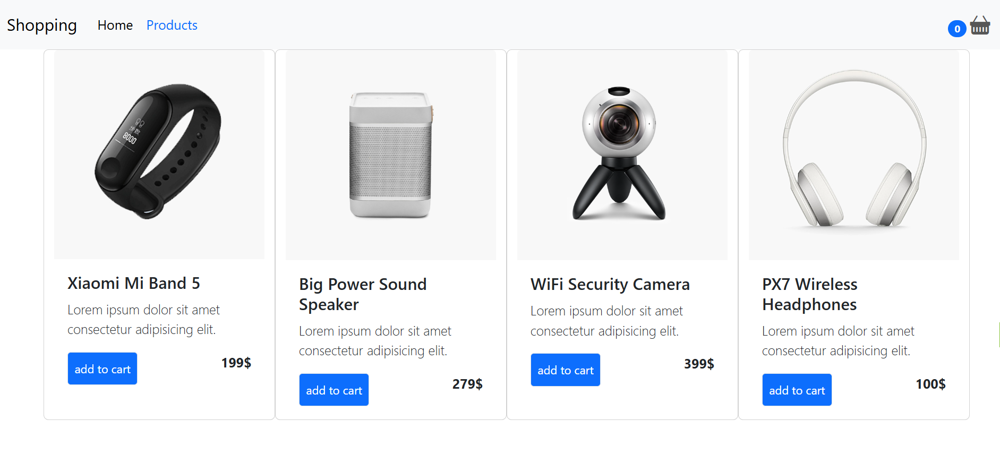

# 🛒 Shopping Cart

A modern and responsive shopping cart web application built with **React** and **Redux Toolkit**.  
Users can browse products, add items to their cart, update quantities, and see the total price dynamically.

---

## 🚀 Features

- 🛍️ Display list of products
- ➕ Add products to cart
- ➖ Remove products from cart
- 🔢 Update item quantity
- 💰 Dynamic total price calculation
- 📱 Responsive design
- ⚡ State management with Redux Toolkit

---

## 🛠️ Built With

- React
- Redux Toolkit
- JavaScript (ES6+)
- CSS
- Vite / Create React App

---

## 📸 Screenshots

### Product Page


### Cart Page


### Mobile View


## 📂 Project Structure
```
shopping-cart/
│
├── public/
│
├── src/
│   ├── components/
│   ├── features/
│   ├── store/
│   ├── App.jsx
│   └── main.jsx
│
├── screenshots/
│   ├── product.png
│   ├── cart.png
│   └── mobile.png
│
├── package.json
├── package-lock.json
└── README.md
```
## ⭐ Support

If you have any questions, suggestions, or issues, feel free to:

- Open an issue in this repository
- Contact me via GitHub: https://github.com/arifrezaie4-dev

If you found this project helpful, consider giving it a ⭐ on GitHub!
